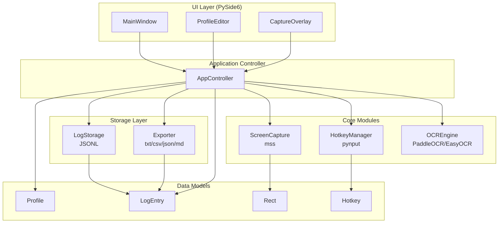
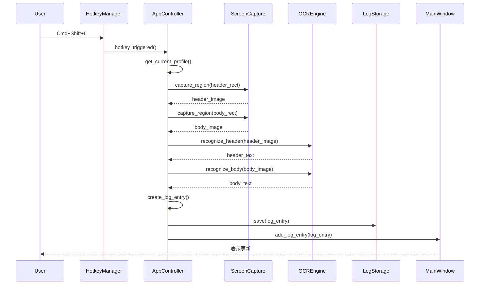

# NoaLog アーキテクチャ概要

## システム構成図



## モジュール一覧

| モジュール | パス | 責務 |
|-----------|------|------|
| ScreenCapture | `core/capture/screen_capture.py` | mssライブラリによる画面キャプチャ |
| HotkeyManager | `core/hotkey/hotkey_manager.py` | グローバルホットキー監視 |
| OCREngine | `core/ocr/ocr_engine.py` | テキスト認識（PaddleOCR/EasyOCR） |
| LogStorage | `core/storage/log_storage.py` | JSONL形式での永続化 |
| Exporter | `core/storage/exporter.py` | 各種フォーマットへのエクスポート |
| MainWindow | `ui/views/main_window.py` | メインUI |
| ProfileEditor | `ui/views/profile_editor.py` | プロファイル編集ダイアログ |
| CaptureOverlay | `ui/widgets/capture_overlay.py` | 領域選択オーバーレイ |
| AppController | `app_controller.py` | アプリケーション統合 |

## キャプチャフロー



## データフロー

```
[画面] → [キャプチャ] → [前処理] → [OCR] → [パース] → [LogEntry] → [Storage/UI]
```

## 設計原則

1. **関心の分離**: Core/UI/Storageの明確な分離
2. **シグナル駆動**: Qt Signalによる疎結合な通信
3. **プロファイル駆動**: 設定はすべてProfileに集約
4. **非破壊編集**: raw_*とedited_*の分離
5. **クロスプラットフォーム**: macOS/Windows両対応
