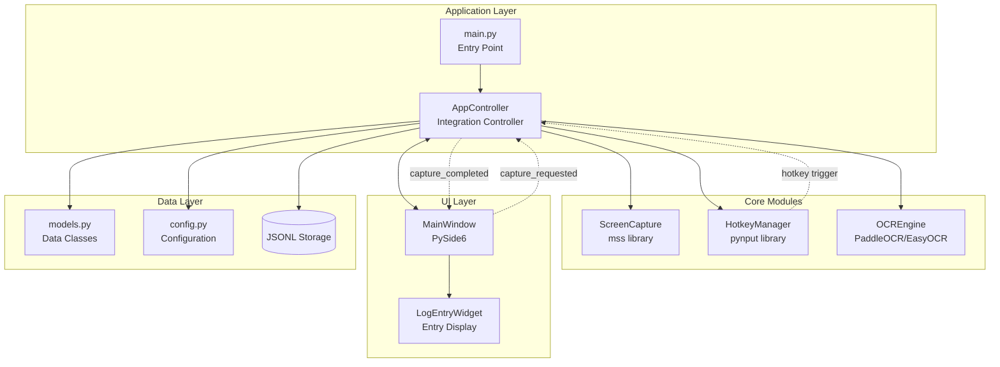
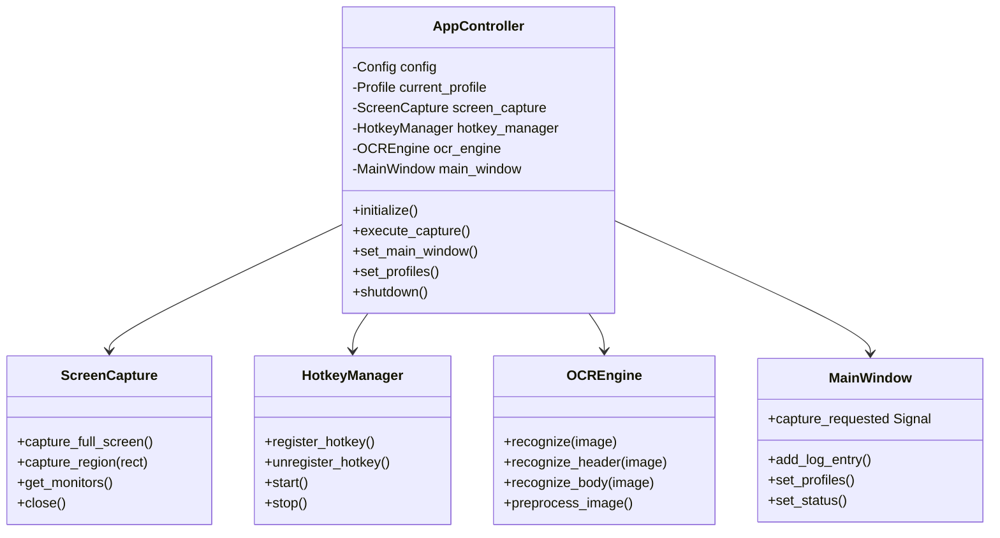
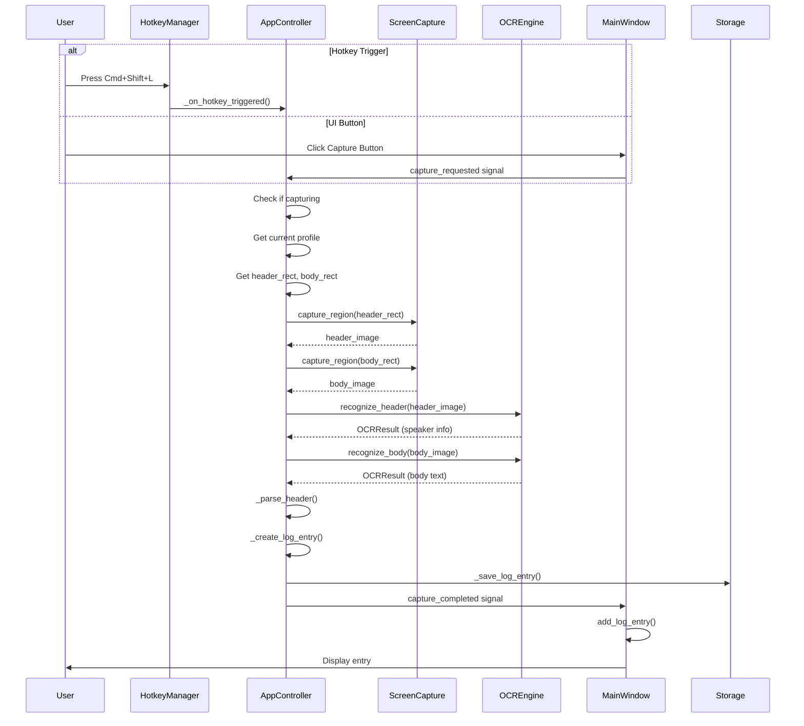
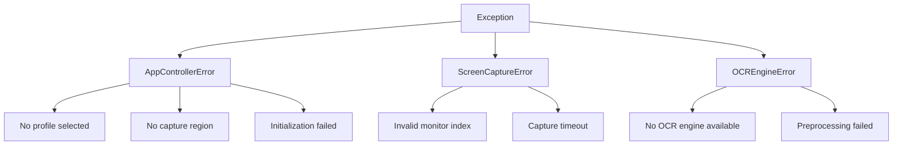
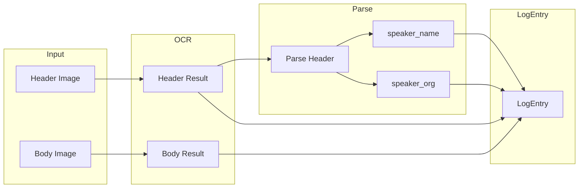

# Window5: Application Integration Controller

## Overview

NoaLogアプリケーションの統合コントローラー（AppController）の設計と実装レポート。

- **実装日**: 2026-01-04
- **ステータス**: Complete
- **関連ファイル**:
  - `/Users/dansetsu/NoaLog/src/app_controller.py`
  - `/Users/dansetsu/NoaLog/src/main.py`

---

## Architecture Overview

### System Architecture Diagram



### Component Relationships



---

## Capture Flow

### Sequence Diagram



### Capture Flow Steps

| Step | Component | Action | Output |
|------|-----------|--------|--------|
| 1 | HotkeyManager/UI | Detect trigger | Callback invocation |
| 2 | AppController | Validate profile | header_rect, body_rect |
| 3 | ScreenCapture | Capture header region | numpy array (BGR) |
| 4 | ScreenCapture | Capture body region | numpy array (BGR) |
| 5 | OCREngine | Recognize header | OCRResult (text, confidence) |
| 6 | OCREngine | Recognize body | OCRResult (text, confidence) |
| 7 | AppController | Parse header | speaker_name, speaker_org |
| 8 | AppController | Create LogEntry | LogEntry instance |
| 9 | Storage | Save to JSONL | File write |
| 10 | MainWindow | Display entry | UI update |

---

## Component Integration Details

### 1. ScreenCapture Integration

```python
# Initialization
self._screen_capture = ScreenCapture()

# Usage in capture flow
header_image = self._screen_capture.capture_region(header_rect)
body_image = self._screen_capture.capture_region(body_rect)
```

**Key Points:**
- mss library for cross-platform support
- Returns BGR numpy arrays (OpenCV compatible)
- Resource management via close() method

### 2. HotkeyManager Integration

```python
# Initialization
self._hotkey_manager = HotkeyManager()

# Register hotkey with callback
self._hotkey_id = self._hotkey_manager.register_hotkey(
    hotkey, self._on_hotkey_triggered
)

# Start listener
self._hotkey_manager.start()
```

**Key Points:**
- pynput library for global hotkey monitoring
- Debounce functionality prevents duplicate triggers
- Profile-specific hotkey registration
- macOS accessibility permission required

### 3. OCREngine Integration

```python
# Initialization
self._ocr_engine = OCREngine(
    lang="japan",
    use_gpu=False,
    use_angle_cls=True,
)

# Recognition with presets
header_result = self._ocr_engine.recognize_header(header_image)
body_result = self._ocr_engine.recognize_body(body_image)
```

**Key Points:**
- PaddleOCR primary, EasyOCR fallback
- Preset-based preprocessing (header/body optimized)
- Returns OCRResult with text, confidence, raw_results

### 4. MainWindow Integration

```python
# Signal connections
window.capture_requested.connect(self.on_capture_requested)
window.profile_changed.connect(self._on_ui_profile_changed)

self.capture_completed.connect(window.add_log_entry)
self.capture_started.connect(lambda: window.set_status("Capturing..."))
```

**Key Points:**
- Qt Signal/Slot pattern for loose coupling
- Bidirectional communication
- Thread-safe UI updates via QTimer.singleShot

---

## Error Handling Strategy

### Error Hierarchy



### Error Handling Pattern

```python
def execute_capture(self) -> Optional[LogEntry]:
    try:
        # Validate preconditions
        if not self._current_profile:
            raise AppControllerError("No profile selected")

        # Execute capture
        header_image = self._capture_region(header_rect, "header")

        # Execute OCR
        header_result = self._ocr_engine.recognize_header(header_image)

        # Create and save entry
        entry = self._create_log_entry(...)
        self._save_log_entry(entry)

        return entry

    except ScreenCaptureError as e:
        self.capture_failed.emit(f"Screen capture failed: {e}")
        return None

    except OCREngineError as e:
        self.capture_failed.emit(f"OCR failed: {e}")
        return None

    except AppControllerError as e:
        self.capture_failed.emit(str(e))
        return None

    finally:
        self._is_capturing = False
```

### Error Recovery Strategies

| Error Type | Strategy | User Feedback |
|------------|----------|---------------|
| No profile | Block capture | Status bar message |
| No region | Block capture | Status bar message |
| Screen capture fail | Abort capture | Error notification |
| OCR fail | Create empty entry | Warning in entry |
| Storage fail | Log error, continue | Silent (logged) |

---

## Data Flow

### LogEntry Creation



### Header Parsing Logic

```python
def _parse_header(self, header_text: str) -> tuple:
    """
    Input: "Alice / Engineering Department"
    Output: ("Alice", "Engineering Department")

    Input: "Bob"
    Output: ("Bob", "")
    """
    separators = ["/", "/"]  # Half-width and full-width
    for sep in separators:
        if sep in text:
            parts = text.split(sep, 1)
            return (parts[0].strip(), parts[1].strip())
    return (text, "")
```

---

## Extension Points

### 1. Additional OCR Engines

```python
# Future: Add Tesseract support
class OCREngine:
    def _try_init_tesseract(self) -> bool:
        try:
            import pytesseract
            self._ocr = pytesseract
            self.engine_type = "tesseract"
            return True
        except ImportError:
            return False
```

### 2. Custom Preprocessing

```python
# Add profile-specific preprocessing
if profile.ocr_settings.get("custom_preset"):
    preset = profile.ocr_settings["custom_preset"]
else:
    preset = "default"
```

### 3. Storage Backends

```python
# Future: Support multiple storage backends
class StorageBackend(Protocol):
    def save(self, entry: LogEntry) -> None: ...
    def load(self, entry_id: str) -> LogEntry: ...
    def query(self, **filters) -> List[LogEntry]: ...

# Implementations
class JSONLStorage(StorageBackend): ...
class SQLiteStorage(StorageBackend): ...
class CloudStorage(StorageBackend): ...
```

### 4. Plugin System

```python
# Future: Hook points for plugins
class CaptureHook(Protocol):
    def pre_capture(self, profile: Profile) -> None: ...
    def post_capture(self, entry: LogEntry) -> None: ...
    def on_error(self, error: Exception) -> None: ...
```

---

## Configuration

### Default Configuration

```json
{
  "ocr": {
    "lang": "japan",
    "use_angle_cls": true,
    "use_gpu": false
  },
  "hotkey": {
    "debounce_ms": 100
  }
}
```

### Profile Configuration

```python
Profile(
    name="Default",
    hotkey=Hotkey(keys=["cmd", "shift", "l"]),
    header_rect=Rect(x=100, y=100, width=400, height=50),
    body_rect=Rect(x=100, y=160, width=600, height=200),
    ocr_settings={
        "header_preset": "header",
        "body_preset": "body",
    }
)
```

---

## Testing Considerations

### Unit Test Areas

| Component | Test Focus |
|-----------|------------|
| AppController | Initialization, signal emission |
| Capture flow | Happy path, error cases |
| Header parsing | Various input formats |
| Profile management | Add, switch, remove |

### Integration Test Areas

| Test | Components Involved |
|------|---------------------|
| Full capture | All modules |
| Profile switch | AppController, HotkeyManager |
| UI interaction | AppController, MainWindow |

### Mock Strategy

```python
# Mock ScreenCapture for tests
@pytest.fixture
def mock_screen_capture():
    capture = Mock(spec=ScreenCapture)
    capture.capture_region.return_value = np.zeros((100, 200, 3), dtype=np.uint8)
    return capture
```

---

## Performance Considerations

### Timing Breakdown (estimated)

| Operation | Typical Time |
|-----------|--------------|
| Screen capture | 50-100ms |
| OCR (header) | 200-500ms |
| OCR (body) | 500-1000ms |
| UI update | 10-50ms |
| **Total** | **760-1650ms** |

### Optimization Opportunities

1. **Parallel OCR**: Run header and body OCR in parallel
2. **Lazy initialization**: Initialize OCR engine on first use
3. **Image caching**: Cache recent captures for undo/redo
4. **Async capture**: Non-blocking capture with progress indication

---

## File Structure

```
src/
├── main.py                 # Entry point
├── app_controller.py       # Integration controller (NEW)
├── config.py               # Configuration
├── models.py               # Data models
├── core/
│   ├── capture/
│   │   └── screen_capture.py
│   ├── hotkey/
│   │   └── hotkey_manager.py
│   ├── ocr/
│   │   └── ocr_engine.py
│   └── storage/
│       └── __init__.py     # TODO: Implement
└── ui/
    └── views/
        └── main_window.py
```

---

## Summary

AppControllerはNoaLogアプリケーションの中核として、以下の機能を提供します:

1. **Module Integration**: ScreenCapture, HotkeyManager, OCREngine, MainWindowの統合
2. **Capture Flow Control**: 一連のキャプチャ処理の制御
3. **Error Handling**: 階層的なエラーハンドリングとユーザー通知
4. **Profile Management**: プロファイル切り替えとホットキー管理
5. **Data Persistence**: LogEntryの保存（JSONL形式）

今後の拡張として、ストレージバックエンドの抽象化、プラグインシステムの導入、パフォーマンス最適化が考えられます。
